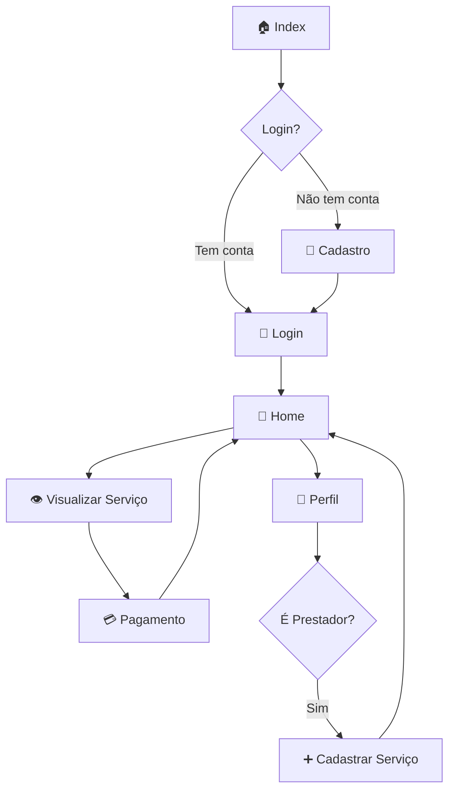

# 🌐 WorkNet

<div align="center">


**Plataforma de conexão entre prestadores de serviços e clientes**

[🚀 Começar](#-como-usar) • [📖 Funcionalidades](#-funcionalidades) • [🏗️ Estrutura](#️-estrutura-do-projeto) • [👥 Usuários](#-tipos-de-usuário)

</div>

---

## 📋 Sobre o Projeto

**WorkNet** é uma plataforma web que facilita a conexão entre **prestadores de serviços** e **clientes** que buscam contratar esses serviços. O sistema oferece cadastro, busca, visualização detalhada e contratação de serviços de forma simples e intuitiva.

---

## ✨ Funcionalidades

### 🔐 Sistema de Autenticação
- ✅ Cadastro de novos usuários (Cliente ou Prestador)
- ✅ Login com validação de credenciais
- ✅ Opção "Manter conectado"
- ✅ Logout seguro

### 👤 Perfil de Usuário
- ✅ Visualização de dados pessoais
- ✅ Estatísticas (serviços, avaliações, contratos)
- ✅ Edição de informações
- ✅ Configurações de conta

### 🛠️ Para Prestadores de Serviços
- ✅ Cadastro de novos serviços
- ✅ Gerenciamento de serviços publicados
- ✅ Definição de preços e descrições
- ✅ Upload de imagens (ou uso de imagem padrão)

### 🔍 Para Clientes
- ✅ Busca de serviços por nome ou categoria
- ✅ Visualização de serviços em destaque
- ✅ Filtro por categorias
- ✅ Visualização detalhada do serviço
- ✅ Contratação de serviços
- ✅ Sistema de pagamento

### 💳 Sistema de Pagamento
- ✅ Pagamento via PIX
- ✅ Pagamento via Cartão de Crédito
- ✅ Salvamento de cartões
- ✅ Cálculo automático de taxas
- ✅ Resumo do pedido

---

## 🎯 Como Usar

### 1️⃣ **Acesse a Página Inicial**
```
📍 index.html
```
- Conheça a plataforma
- Veja serviços populares
- Entenda como funciona

### 2️⃣ **Faça Login ou Cadastro**
```
📍 login.html → cadastro.html
```

**Para Cadastro:**
- Preencha nome, email, senha, CPF
- Escolha o tipo: **Cliente** ou **Prestador**
- Confirme o cadastro

**Para Login:**
- Digite email e senha
- Marque "Manter conectado" (opcional)
- Entre na plataforma

### 3️⃣ **Navegue pela Home**
```
📍 home.html
```

**Como Cliente:**
- 🔍 Busque serviços na barra de pesquisa
- 📂 Filtre por categorias
- 👁️ Visualize serviços em destaque
- 🖱️ Clique em um serviço para ver detalhes

**Como Prestador:**
- ➕ Cadastre seus serviços
- 📝 Gerencie suas publicações
- 👁️ Visualize outros serviços

### 4️⃣ **Visualize o Serviço**
```
📍 tela_do_serviço.html
```
- 📸 Veja fotos e descrição completa
- 💰 Confira o preço
- 👤 Conheça o prestador
- 🔗 Veja serviços relacionados
- 💼 Clique em "Contratar Serviço"

### 5️⃣ **Finalize o Pagamento**
```
📍 tela_pagamnto.html
```
- 📋 Revise o resumo do pedido
- 💳 Escolha a forma de pagamento
- ✅ Confirme e pague
- 🎉 Pronto! Serviço contratado

---

## 👥 Tipos de Usuário

### 🙋 Cliente
```
✅ Pode buscar serviços
✅ Pode contratar serviços
✅ Pode visualizar perfil próprio
❌ Não pode cadastrar serviços
```

### 👷 Prestador de Serviços
```
✅ Pode cadastrar serviços
✅ Pode gerenciar serviços
✅ Pode buscar outros serviços
✅ Pode contratar serviços
✅ Pode visualizar perfil próprio
```

---

## 🏗️ Estrutura do Projeto

```
WorkNet/
│
├── 📄 index.html              # Página inicial (pública)
├── 📄 login.html              # Tela de login
├── 📄 cadastro.html           # Tela de cadastro
├── 📄 home.html               # Home (autenticada)
├── 📄 perfil.html             # Perfil do usuário
├── 📄 cadastro_servico.html   # Cadastro de serviços
├── 📄 tela_do_serviço.html    # Detalhes do serviço
├── 📄 tela_pagamnto.html      # Página de pagamento
│
├── 📁 style/                  # Arquivos CSS
│   ├── index.css
│   ├── login.css
│   ├── cadastro.css
│   ├── home.css
│   ├── perfil.css
│   ├── cadastro_servico.css
│   ├── telaservico.css
│   └── pagamento.css
│
├── 📁 JS/                     # Arquivos JavaScript
│   ├── login.js
│   ├── cadastro.js
│   ├── home.js
│   ├── perfil.js
│   ├── tela_servico.js
│   └── pagamento.js
│
└── 📁 img/                    # Imagens e ícones
    ├── icons/
    └── ...
```

---

## 🔄 Fluxo de Navegação



---

## 💾 Armazenamento de Dados

O sistema utiliza **localStorage** do navegador para persistir dados:

| Chave | Descrição |
|-------|-----------|
| `usuarios` | Array com todos os usuários cadastrados |
| `usuarioLogado` | Dados do usuário atualmente logado |
| `servicos` | Array com todos os serviços publicados |
| `servicoSelecionado` | Serviço que está sendo visualizado |

> ⚠️ **Nota**: Em produção, esses dados devem ser armazenados em um banco de dados real.

---

## 🎨 Características de Design

- ✨ Interface moderna e limpa
- 📱 Design responsivo
- 🎯 Navegação intuitiva
- 🌈 Cores agradáveis e profissionais
- ⚡ Animações suaves
- 🔔 Notificações visuais

---

## 🔒 Segurança

- ✅ Validação de formulários
- ✅ Verificação de autenticação em páginas protegidas
- ✅ Redirecionamento automático para login se não autenticado
- ✅ Logout limpa todos os dados da sessão

> ⚠️ **Atenção**: Este é um projeto educacional. Em produção, implemente:
> - Criptografia de senhas (hash)
> - Autenticação via API/Backend
> - Tokens JWT
> - HTTPS obrigatório

---

## 🚀 Como Executar

### Opção 1: Servidor Local
```bash
# Navegue até a pasta do projeto
cd WorkNet

# Abra com um servidor local (exemplo com Python)
python -m http.server 8000

# Acesse no navegador
http://localhost:8000/index.html
```

### Opção 2: Live Server (VS Code)
1. Instale a extensão "Live Server"
2. Clique com botão direito em `index.html`
3. Selecione "Open with Live Server"

### Opção 3: Diretamente no Navegador
Abra o arquivo `index.html` diretamente no navegador
(Algumas funcionalidades podem ter limitações)

---

## 📱 Navegação Rápida

| Ação | Onde Encontrar |
|------|----------------|
| Criar conta | `index.html` → Botão "Entrar" → "Cadastrar" |
| Fazer login | `index.html` → Botão "Entrar" |
| Buscar serviços | `home.html` → Barra de pesquisa |
| Ver perfil | Qualquer página autenticada → Botão "Conta/Perfil" |
| Cadastrar serviço | `perfil.html` → "Cadastrar Serviço" (apenas prestadores) |
| Contratar serviço | `home.html` → Clique no serviço → "Contratar" |
| Fazer logout | Qualquer página autenticada → Botão "Sair" |

---

## 🎓 Conceitos Aplicados

- 📐 **HTML5 Semântico**
- 🎨 **CSS3 Moderno** (Flexbox, Grid, Animações)
- ⚡ **JavaScript Vanilla** (ES6+)
- 💾 **LocalStorage API**
- 🔄 **SPA-like Navigation**
- 📱 **Responsive Design**
- 🎯 **User Experience (UX)**
- 🔐 **Autenticação Client-Side**

---

## 📌 Observações Importantes

1. **Dados de Teste**: Ao fazer o primeiro cadastro, crie uma conta de prestador para testar todas as funcionalidades

2. **Imagens**: Se uma imagem não carregar, o sistema usa automaticamente uma imagem padrão

3. **Navegação**: Use sempre os botões e links do sistema. Não use os botões voltar/avançar do navegador

4. **Categorias Disponíveis**:
   - 🧹 Limpeza e Conservação
   - 🏗️ Construção e Reformas
   - ⚡ Elétrica
   - 🚰 Hidráulica e Encanamento
   - 🌳 Jardinagem e Paisagismo
   - 🎨 Pintura
   - 🪵 Marcenaria
   - 💻 Tecnologia e Informática
   - 💅 Beleza e Estética
   - 🚚 Transporte e Mudanças
   - 📦 Outros

---

## 🤝 Contribuindo

Este é um projeto educacional. Sinta-se livre para:
- 🐛 Reportar bugs
- 💡 Sugerir melhorias
- 🔧 Fazer modificações
- 📚 Usar como base para aprendizado

---

## 📄 Licença

Este projeto é de código aberto para fins educacionais.

---

<div align="center">

### 🌟 Feito com dedicação para conectar pessoas e serviços

**WorkNet** - Onde profissionais e clientes se encontram

---

📧 Contato • 🐛 Reportar Bug • ⭐ Dar Estrela • 🔄 Fork

</div>
